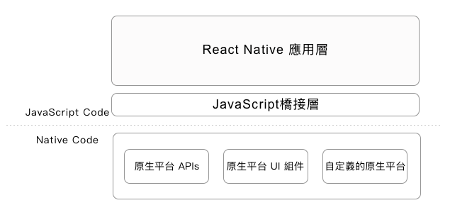

# Chap 01. React Native 入門和基礎

## 歷史

- React Native 第一次進入公關視野：2015 年 1 月 React.js Conf
- React Native 宣布開源：2015 年 5 月 F8 Conference
- React Native 一開始僅支援 iOS App 開發，2015 年 9 月起也支持 Android App 開發，而後也隨著 Sansung Tizen 與 Windows Phone 的加入而支持

## React Native 與 React

- React Native 與 React 使用相同開發語言 JavaScript 和相同的設計理念
- React Native 與 React 運行的環境和平台完全不同，React Native 基於移動平台，React 則基於瀏覽器

## React Native 跨平台

1. 原生應用
    - 優勢：較高的平台成熟度，包含平台穩定性、運行性能及完善生態
    - 缺點：開發成本高，開發效率低，需要多個原生平台熟悉的開發工程師

2. 跨平台應用
    - 為滿足多平台需求，有幾種常見的跨平台解決方案：
        - 混合應用開發：在移動瀏覽器中嵌入 HTML 頁面來開發移動應用，代表的有 Apache Cordova，以及基於 Apache Cordova 衍生的 Ionic
        - 跨平台語言：基於 .NET 和 C# 的 Xamarin，基於 Ruby 的 RubyMotion
        - React Native：使用 Web 開發語言 JavaScript 和環境 Node.js。類似技術還有 NativeScript、Weex 等

## React Native 應用結構



- React Native 應用開發使用的是與 React 相同的開發語言 JavaScript 和設計思想 React
- 底層仍然是基於原生平台的

不同平台的適配就交由 React Native 平台去處理，開發者只需關注 React Native 平台應用開發本身，其優勢：

- 應用層開發變得簡單、高效和跨平台
- 應用穩定性、運行時的性能和原生平台接近
- 理解 React Native 原理後，開發者也可根據實際產品需求開發自己的 React Native 組件，以復用已有原生平台的大量優秀組件

## React Native 特點

### 1. Learn Once, Write Anywhere：React Native 的宣傳廣告

### 2. 簡單易學的開發語言

- 與 Objective-C 或 Java 相比，JavaScript 上手速度要快得多
- JSX 語法擴展，提高了代碼可讀性和開發效率
- 簡單的樣式 (類 CSS) 和佈局 (Flexbox) 技術

### 3. 接近原生應用的性能和體驗

混合應用開發也有前述兩個優點，但在實際開發中卻存在性能和體驗不佳的先天不足 (其原理是在移動瀏覽器裡嵌入 HTML 頁面，導致原生平台的性能優勢無法充分發揮出來)

混合應用開發方式從 PhoneGap 發展到 Apache Cordova，而且衍生的 Ionic 也都不斷強調和優化性能，但是現階段，在移動瀏覽器中嵌入 HTML 頁面的運行效率，仍然無法和原生應用相媲美

React Native 雖然使用類似混合應用開發的語言，但是其實現機制卻完全不同；React Native 的底層仍然是基於原生平台的！所以，React Native 在性能和體驗上與原生應用沒有太大差別，用戶很難區分所使用的 App 到底是原生開發還是 React Native 開發

### 4. 完善的生態系統

生態系統是衡量一個開發平台成熟度的重要標誌

React Native 在 Github 上線第一天 5000 多顆星，截至現在 2018 年 1 月逼近 60,000 顆星、13,000 多次 Fork 及 12,000 多次提交就可看出

Google Trends 趨勢熱度也反映出 React Native 開發趨勢

同時，Facebook 也大力支持與推廣 React Native，推出官方調試工具 React Developer Tools 和開發工具 Nuclide

另外，網路還有大量優秀的開源項目可供學習和參考：

- React Native 開源庫檢索網站 [JS.coach](https://js.coach/?collection=React+Native)
- React Native 學習資源彙總項目 [awesome-react-native](https://github.com/jondot/awesome-react-native)


## 搭建 React Native 開發環境

搭建 React Native 開發環境有幾個主要步驟：

- 原生開發工具：iOS 的 Xcode，Android 的 Android Studio and SDK Tools
- Node.js，React Native 是借助 Node.js
- React Native：安裝 React Native 命令行工具
- 其他輔助工具：代碼編輯器 Nuclide、遠程調試工具 Chrome Browser 等

### 安裝原生開發工具 -- Android

1. 安裝 JDK
2. 安裝 Android Studio and SDK Tools
3. 第一次打開 Android Studio，需在“設置”中配置 Android SDK Tools 的路徑 Android SDK Location
4. 成功配置 android SDK Tools 的路徑後，還要下載和安裝 SDK 相關工具
5. 將 Android SDK Tools 的路徑加入到系統變量 PATH 中

    (Node.js、npm、React Native 也都需要依據狀況添加到系統變量 PATH 中)

    ```shell
    export ANDROID_HOME=${HOME}/Library/Android/sdk
    export PATH=${PATH}:${ANDROID_HOME}/tools
    export PATH=${PATH}:${ANDROID_HOME}/platform-tools
    ```

### 安裝原生開發工具 -- iOS

使用 React Native 開發 iOS 應用需要 macOS

XCode 安裝簡單，只要透過 Apple Store 安裝即可

### 安裝 Node.js

建議使用 nvm 安裝，可管理不同版本的 node.js

### 安裝 React Native

```shell
npm install -g react-native-cli
```

### 安裝其他輔助工具

#### Nuclide 開發工具

Nuclide 是 Facebook 官方推出的一款 React Native 開發工具，它基於 Atom 的一個擴展。強烈推薦，原因：

- 官方出品，對 React Native 新特性及開發、調試支持更好
- 基於 Atom，擁有龐大的第三方插件庫

安裝 Atom，並在 Setting | Install Plugin 安裝 Nuclide

#### Chrome 瀏覽器

Chrome 瀏覽器是 React Native 開發的遠程調試工具，安裝後再安裝 React Developer Tools 插件

#### Watchman 工具

由 Facebook 提供，監視文件系統變更的工具，它可提高開發時的性能 (捕捉文件變化從而實現實時刷新)

```shell
brew update
brew install watchman
```

## 第一個 React Native 應用

### 初始化

```shell
react-native init ch02
```

目錄和文件詳細說明：

- `__tests__`：React Native 工程單元測試文件夾
- android：原生 Android 工程文件夾
- ios：原生 iOS 工程文件夾
- node_modules：React Native 工程依賴的第三方庫
- index.android.js：React Native 工程 Android App 入口文件
- index.ios.js：React Native 工程 iOS  App 入口文件
- package.json：React Native 工程配置文件，描述了工程的所有信息以及第三方庫的依賴關係

### 運行

1. 運行 iOS App

    ```shell
    xcrun simctl list devices
    react-native run-ios --simulator "iPhone 7"
    ```
2. 運行 Android App

    ```shell
    adb devices
    react-native run-android emulator-5554
    ```

### 調試

- iOS：command + D
- Android：command + M